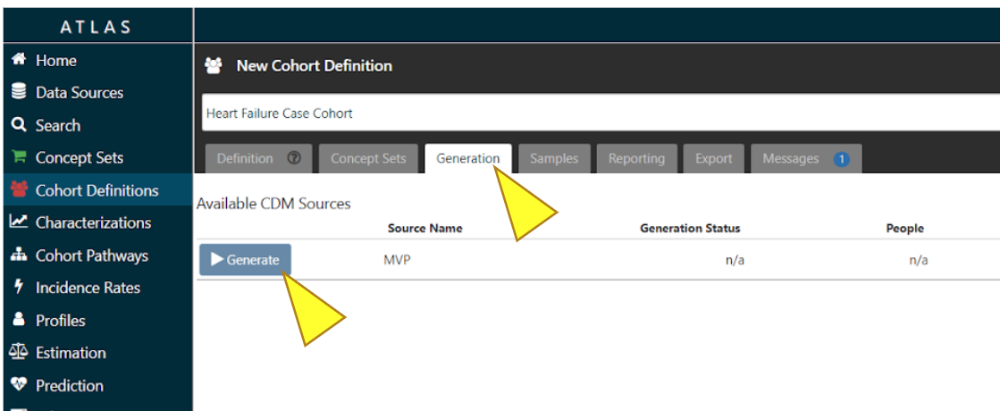

# **OHDSI ATLAS**  

[Observational Health Data Sciences and Informatics (or OHDSI](https://www.ohdsi.org/), pronounced "Odyssey") is a community developing open-source large-scale analytics solutions to bring out the value of health data. One such solution is ATLAS.  

ATLAS is an open-source software application intended to provide a unified interface to patient-level data and analytics. ATLAS software is used to define cohorts, typically dichotomous variables, for analysis.

ATLAS currently includes functionality for searching and navigating the vocabulary within the [OMOP Common Data Model (CDM)](https://ohdsi.github.io/TheBookOfOhdsi/CommonDataModel). Users are encouraged to use the [MVP Data Dictionary](./data-dictionary.md) to help with comprehension and curation of custom sets. In addition to the search and navigation capabilities, ATLAS also provides features to curate and export custom sets of concept identifiers for use in cohort definitions. These will automatically populate on the Gen3 GWAS App.

In general, ATLAS is an analytics platform that can be used to perform analyses across one or more observational databases which have been standardized to the OMOP Common Data Model V5 and can facilitate exchange of analysis designs with any other organizations across the OHDSI community.

Tutorials for the ATLAS tool can be found **[here](https://github.com/OHDSI/Atlas/wiki)** and also in the **[link to the MVP data dictionary link](https://vincicentral.vinci.med.va.gov/SitePages/VINCI_University-VADC_Academy.aspx)** (*only accessible from the VA VPN*). The **[Book of OHDSI can be found here](https://ohdsi.github.io/TheBookOfOhdsi/)**. These resources contain a lot of useful information. For using the ATLAS app on this platform, you may find it particularly useful to read about **[Cohort Definition](https://ohdsi.github.io/TheBookOfOhdsi/Cohorts.html#Cohorts)**. It is highly advisable that you familiarize yourself with these resources before proceeding.

## **Steps to Generate a Cohort**

A cohort is a set of persons who satisfy one or more inclusion criteria for a duration of time. Once created, the cohort can then be the basis for inputs for your subsequent analyses (e.g., GWAS).

### **Step 1: Create a Concept Set**

Concept Sets are a list of codes created by searching the standardized vocabulary and selecting the set of terms for your analyses. Here, you select all concepts (variables) that you would like to use for criteria that define your study population cohort.

Select Concept Sets in the menu and click the blue box for “New Concept Set”.

In the box above the tabs, enter a name for the Concept Set you are creating.

Click the green box “Add concepts” to view the list of concept variables.

Enter the concept name or code into the search bar to find relevant concept variables. 

Check the box to select the desired concepts, then click “Add To Concept Set”. Repeat Search and Add steps as needed, then click “Concept Sets” in the left navigation pane.  

When all desired concepts are included in your Concept Set, click the Save icon to the right of the name of the Concept Set.

To add new concepts, please use the “Add Concepts” button again as described above.

To delete the concepts from the concept set, select the concepts to be removed. Click on the “Remove Selected” button, then click the Save icon to save your changes.

### **Step 2: Create Cohort Definition**

A cohort is a set of persons who satisfy one or more inclusion criteria for a duration of time.

Use the concept sets to create initial events and other criteria for defining the study population cohort. A cohort is defined as a Person with an entry and exit date. Thus, a person can be in a cohort multiple times if they meet the criteria.

Select “Cohort Definitions” in the menu, you can begin to create a cohort by clicking the “New Cohort” button.

In the boxes above and below the tabs, enter a name and description for the Cohort.

To establish the duration for your cohort, click “+ Add Initial Event”, then in the dropdown menu click “Add Observation”.

Click the blue box “Any Observation”, select “Import Concept Set” from the dropdown menu.

Select the Concept Set you just made. This establishes your Concept Set as inclusion criteria for your cohort.

To access the table in the MVP harmonization database, click “+ Add attribute…”, then click “Add Value as Number Criteria”.

Select “Greater or Equal To”. In this specific case we added Heart Failure concept Set and entered value "2". This will allow for the collection of data from the Observation table of the MVP harmonization database.

If you would like to add additional inclusion criteria, click “New inclusion criteria” select criteria or import another configuration. To complete the Cohort Definition, click the green Save icon.

### **Step 3: Generate Cohort**

Once created, the cohort can then serve as the basis of inputs for your subsequent analyses. Use the cohort definition to identify how many people are in the cohort. This is the initial number that will be used in the GWAS App when this cohort is selected.

To complete the creation of the Cohort Definition, click “Generation”, then “Generate”.

Cohort size will be displayed under the column “People”. Use View Reports to see if you have inclusion criteria that causes cohort attrition.

The “Export” tab provides a text version of how a cohort was created. Click on the “Export” tab and then on the “Copy to clipboard” to copy the cohort’s information.

We expect that this documentation along with the OHDSI tutorials are sufficient for most analyses that users will attempt. If you have any questions, please contact us at [vadc@lists.uchicago.edu](mailto:vadc@lists.uchicago.edu).